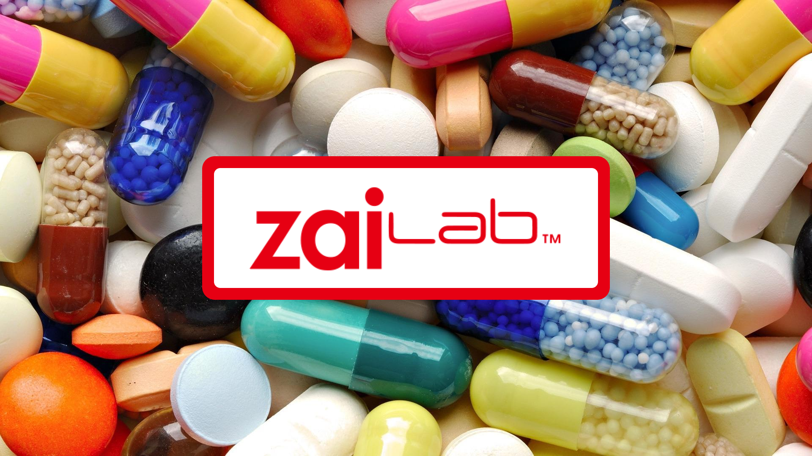
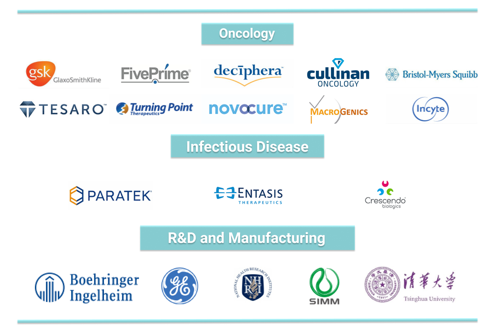
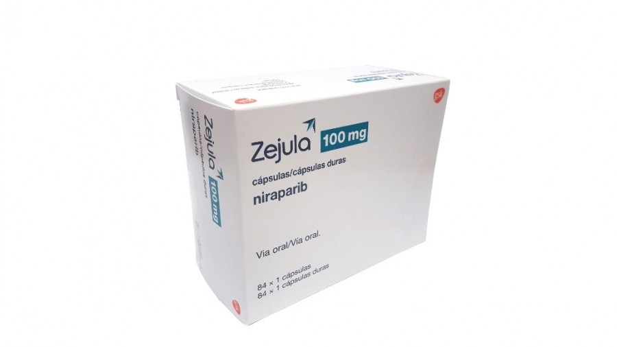
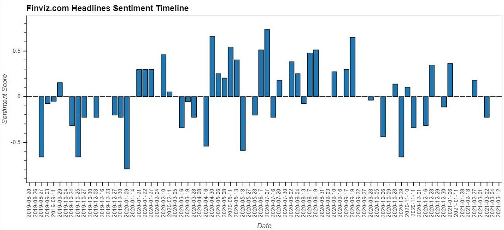
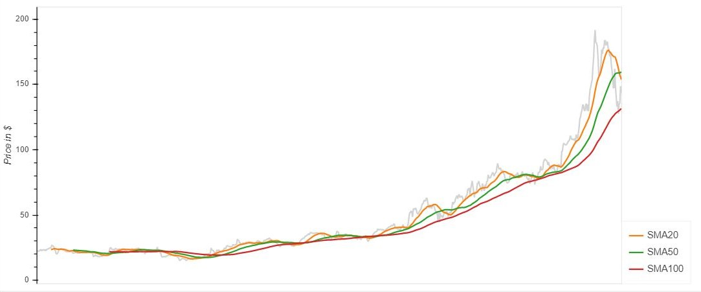
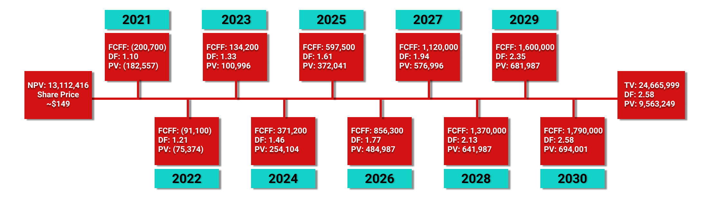

# Market Research and Financial Analysis: ZLAB
---

## Background

Everyone has heard of the phrase "Big money's in Pharma." But how big is the money for developing pharmaceutical companies? Today, we will embark on the journey of analyzing Zai Lab Limited. Zai Lab Limited is a Chinese pharmaceutical company with a mission to serve patients dealing with cancer, autoimmune, and infectious diseases worldwide. 

As a growing Pharmaceutical company, clinical trials and commercialization investment can vary year to year as new Clinical Trial Applications (CTAs) and New Drug Applications (NDAs) are approved. Therefore, we will explore the risks and probability of success for its products. Thus, under the uncertainty of drug approvals and many factors for risks related to commercialization, the final DCF valuation may not accurately represent the inherent value. 

So, this project will focus on three tasks to assess the investment in ZLAB:

1. [Company Profile](#Company-Profile)
2. [Risk Assessment](#Risk-Assessment)
2. [Discounted Cash Flow](#Discounted-Cash-Flow)

#### Disclaimer: It is not intended to be investment advice. Seek a duly licensed professional for investment advice.
---

## Company Profile

Zai Lab is one of the fastest-growing biotech companies listed on the NASDAQ. Zai Lab focuses on becoming the biggest pharmaceutical company providing oncology, autoimmune disorders, and infectious diseases therapy in the Chinese market. By 2023, it aims to become one of the leading global biopharmaceutical companies.  

As of 2020, Zai Lab has 21 product candidates in its pipeline. Seventeen are in a clinical trial. Of those seventeen, eleven are in a late-stage clinical trial. Of the 21 drug candidates, seven are internally developed products where two are entering phase-1 of the clinical trial. Even though the lab only has seven of its internally developed products, it increased its drug portfolio by partnering with medium to large pharmaceutical companies to license products. 

Zai Lab's strategic partnership poses an enormous potential for profit if the China National Medical Products Association (NMPA) approves the licensed products. However, Zejula and Optune are currently the only two products in the commercial stage generating Zai Lab's revenue.

### Greater Market and Product Overview

China has recently become the second-largest pharmaceutical market in the world. The [IQVIA Report](Resources/the-global-use-of-medicine-in-2019-and-outlook-to-2023.pdf) describes that the Chinese pharmaceutical market is worth 137 billion dollars in 2018, with a 3-6% compounded annual growth rate (CAGR) going forward. According to the [China Oncology Drug Market Research](https://www.alliedmarketresearch.com/china-oncology-drugs-market), China's oncology market will grow at an 8.7% compounded annual growth rate from 2018 to 2026. With the same CAGR as a benchmark, the China oncology market will be around 17.5 billion dollars. Approximately 3 to 4 million new cancer cases are also reported in China annually.

Many biopharma companies expanding to the Chinese market are implementing many licensed-in deals because the licensed-in compounds already have a track record of proven safety and efficacy in the early development phases. Therefore, there is a higher chance of NDA approval for licensed-in products compared to internally developed products. Zai Lab's utilization of strategic partnerships increases the value of the company. As of 2021, Zai Lab's product portfolio includes 21 products with 14 licensed-in products from 12 partnering pharmaceutical companies. 

| Partners of Zai Lab Limited       |
| --------------------------------- |
|  |

Zai Lab's oncology pipeline focuses on four common tumor types; ovarian cancer, gastrointestinal cancer, lung cancer, and brain cancer. Most compounds are synergistic late-stage assets, and one compound can target multiple indications as listed on the [company website](http://www.zailaboratory.com/pipeline/list.aspx). As of March 2021, its product portfolio consists of two marketed drugs, Zejula and Optune, in Mainland China, Macau, and Hong Kong. 

In December 2020, China's National Healthcare Association included Zejula in the National Reimbursement Drug List (NRDL). It means that Zai Lab has to sell Zejula at a negotiated discounted price but with broader access to the Chinese patient population. Since its commercial launch in January 2020, 67 commercial health insurance plans and 44 supplemental insurance plans created by local or municipal governments have included Zejula in their plans. It generated 6.6 million and 32 million dollars in sales respectively in 2019 and 2020.

Within the tumor treating fields, Zai Lab launched Optune Lua™ in August 2020. This medical device uses electric fields tuned to specific frequencies to disrupt cell division, inhibiting tumor growth and potentially causing cancer cell death. In June 2020, China's Commerical Health Insurance supported Optune® as the first innovative medical device, and ten supplemental insurance plans have also listed the device in their plans. It generated 6.4 million and 16.4 million dollars in sales respectively in 2019 and 2020. 

| [ZEJULA](https://bit.ly/2OjOeE3) | [Optune Lua](https://www.optunelua.com/) |
| -------------------------------- | ---------------------------------------- |
|  |  | 

In the first half of 2021, NMPA may approve the NDA submitted for QINLOCK® (ripretinib). QINLOCK® is the only therapeutic approved in the United States for advanced GIST patients who have received prior treatment with three or more kinase inhibitors in the all-comer setting. In the Autoimmune department, Zai Lab is waiting for the potential approval of NUZYRA® (Omadacycline) from NMPA by the end of 2021. The following tables provide a snapshot of Zai Lab's product portfolio.

#### Oncology Products

| Molecule Name               | Drug-Origin | Pre-Clinical | Phase 1 | Phase 2 | Phase 3 | NDA Filed | Marketed | 
| --------------------------- | ----------- |------------ | ------- | ------- | ------- | --------- | -------- |
| Niraparib (PARP)            | GlaxoSmithKline |<ul><li> [x] </li><li> | :heavy_check_mark: | :heavy_check_mark: | :heavy_check_mark: | :heavy_check_mark: | :heavy_check_mark: | 
| Tumor Treating Fields       | Novacure |:heavy_check_mark: | :heavy_check_mark: | :heavy_check_mark: | :heavy_check_mark: | :heavy_check_mark: | :heavy_check_mark: |
| Ripretinib (KIT, PDGFRα)    | Deciphera |:heavy_check_mark: | :heavy_check_mark: | :heavy_check_mark: | :heavy_check_mark: | :heavy_check_mark: |   |
| Odronextamab (CD20xCD3)     | Regeneron |:heavy_check_mark: | :heavy_check_mark: | :heavy_check_mark: | :heavy_check_mark: | | |
| Repotrectinib (ROS1, TRK)   | Turning Point |:heavy_check_mark: | :heavy_check_mark: | :heavy_check_mark: | :heavy_check_mark: | | |
| Margetuximab (HER2)         | MacroGenics |:heavy_check_mark: | :heavy_check_mark: | :heavy_check_mark: | :heavy_check_mark: | | |
| Bemarituzumab (FGFR2b)      | Five Prime |:heavy_check_mark: | :heavy_check_mark: | :heavy_check_mark: | | | |
| CLN-081 (EGFR ex20ins)      | Cullinan |:heavy_check_mark: | :heavy_check_mark: | :heavy_check_mark: | | | |
| TPX-0022 (MET)              | Turning Point |:heavy_check_mark: | :heavy_check_mark: | | | | |
| Tebotelimab (PD-1xLAG-3)    | MacroGenics |:heavy_check_mark: | :heavy_check_mark: | :heavy_check_mark: | | | |
| Retifanlimab (PD-1)         | Incyte |:heavy_check_mark: | :heavy_check_mark: | :heavy_check_mark: | :heavy_check_mark: | | |
| ZL-2309 (CDC7)              | Self-Originated |:heavy_check_mark: | :heavy_check_mark: | | | | |
| ZL-1201 (CD47)              | Self-Originated |:heavy_check_mark: | :heavy_check_mark: | | | | |
| ZL-1211                     | Self-Originated |:heavy_check_mark: | | | | | |
| ZL-2201                     | Self-Originated |:heavy_check_mark: | | | | | |
| ZL-1218                     | Self-Originated |:heavy_check_mark: | | | | | |
| ZL-2103                     | Self-Originated |:heavy_check_mark: | | | | | |

#### Infectious Disease and Autoimmune Products

| Molecule Name               | Partner | Pre-Clinical | Phase 1 | Phase 2 | Phase 3 | NDA Filed | Marketed | 
| --------------------------- | ------- | ------------ | ------- | ------- | ------- | --------- | -------- |
| Omadacycline                | Paratek |:heavy_check_mark: | :heavy_check_mark: | :heavy_check_mark: | :heavy_check_mark: | :heavy_check_mark: | | 
| Sulbactam-Durlobactam       | Entasis |:heavy_check_mark: | :heavy_check_mark: | :heavy_check_mark: | :heavy_check_mark: | | |
| Efgartigimod (FcRn)         | Argenx  |:heavy_check_mark: | :heavy_check_mark: | :heavy_check_mark: | :heavy_check_mark: | | |
| ZL-1102 (IL-17)             | Self-Originated |:heavy_check_mark: | :heavy_check_mark: | | | | |

#### Market Sentiment

A quick look at the market sentiment for Zai Lab suggests that it is relatively equal between positive and negative. I used [Finviz](https://finviz.com/), a website that provides information on stock prices and news headlines related to each stock. As a financial information website, the articles are relevant to the stock market. Also, they include the most pertinent articles on the current news of Zai Lab that average investors can view to make a buy/sell decision.

##### Files

1. [Finviz Headlines](Codes/sentiment_analysis_finviz.ipynb)
2. [Sentiment Visualizations](Codes/sentiment_visualization.ipynb)
3. [Simple Moving Averages Price Chart](Codes/sma_price_chart.ipynb)

| 20 Months Linear Timeline of Zai Lab Headlines within Aug-2019 to Mar-2021 |
| -------------------------------------------------------------------------- |
|  |

| Percent Total by Sentiment for Zai Lab Headlines |
| ------------------------------------------------ |
|  |

The latest decline in sentiment is due to the burst in the tech stock bubble. In 2020, many investors overcrowded their investments in the technology sector which were not adversely affected by the pandemic. When the 10-year treasury bond-yields rates increased with high velocity on February 19th, many institutional investors reallocated their assets into value stocks. Nonetheless, the correlation between the 10-year bond rates and the tech stock is unclear. 

Only when the rates increase with high-velocity can one witness a sell-off in the tech stocks for the days between February 19th and March 12th. As of writing this, the date is March 14th. We may or may not see more sell-off. 

However, tech and biotech stocks' volatility will be high in the coming months with the inflation fear. As the following chart of Zai Lab's stock prices suggests, the 20-day simple moving average is crossing below the 50-day simple moving average, which the investors can assume is entering a short-term bear market territory. 

| Price Chart with 20, 50, and 100 Simple Moving Averages |
| ------------------------------------------------------- |
|  |

---
## Risk Assessment

There are enormous risks in investing in Zai Lab. Investors not only have to anticipate approvals, but they also have to expect successful commercialization of the approved product. There are many areas of risks to consider, according to Zai Lab's financial reports. They are risks related to the financial position and need for additional capital, the business, and industry, Zai Lab's dependence on third parties, doing business in China, Intellectual properties.

Zai Lab has incurred significant losses and will continue to incur losses for the foreseeable future. The net losses are due to the heavy research and development expenses. If the company cannot increase its revenue to a certain number, an investor may reallocate their money into other businesses deemed more worthy. Zai Lab's partnerships with third parties may also pose a risk because if the partnering product fails, Zai Lab's drugs or devices may also become unmarketable. Therefore, creating a benchmark of requirements to assess if one's investment is still or no longer feasible under the set fundamentals is essential.

One way to create a baseline is to set a required amount of approvals under the general probability of success. Then, one can account for the revenues and expenses associated with the approved products into account when forecasting future returns. The tables below show the probability of success for product-line and drug-origins and each phase's cost and timing as referenced in the [Alacrita Consulting Report](Resources/Pharmaceutical-Probability-of-Success.pdf). 

#### Probability of Success by Product Category: 

| Product | Phase 1 | Phase 2 | Phase 3 | Registration to Approval | Overall Likelihood of Approval |
| -------- | ------- | ------- | ------- | ------------------------ | ------------------------------ |
| Oncology | 64.0% | 33.7% | 46.9% | 88.0% | 8.9% |
| Autoimmune Diseases | 68.8% | 40.1% | 62.0% | 88.8% | 15.2% |
| Infectious Diseases | 65.9% | 49.8% | 72.2% | 91.2% | 21.6% |

#### Probability of Success by Drug-Origin:

| Drug-Origin | Phase 1 | Phase 2 | Phase 3 | Registration to Approval | Overall Likelihood of Approval |
| ----------- | ------- | ------- | ------- | ------------------------ | ------------------------------ |
| Self-Originated | 65.0% | 40.0% | 64.0% | 93.0% | 15.5% |
| Licensed-in Deal | 82.0% | 56.0% | 64.0% | 93.0% | 27.3% |

#### Costs and Timing for Pharmaceutical Development:

| Phase | Number of Patients | Cost (USD) | Time (Year) |
| ----- | ------------------ | ---------- | ----------- |
| 1 | 35 | 2.4M | 1.5 |
| 2 | 100 | 20M | 2 |
| 3 | 800 | 64M | 4 |
| Regulatory Cost | | 10M | 1 |

Oncology drugs have a lower overall likelihood of approvals (LOA) than the Autoimmune and Infectious diseases category. However, 14 products in the Zai Lab's product portfolio have a higher LOA because those are licensed-in products. Ripretinib and Omadacycline have a 93% LOA and have a high likelihood of making sales in 2022. In the six phase-3 licensed-in drugs, four drugs may get approval. Accounting for the time needed for phase-3 to approval, we can assume that Zai Lab will make sales by 2025 and forward if approved. 

At least one licensed-in drug from the four drugs in the early stage may also get approval. Within the seven self-originated compounds, there's a chance that at least one will be approved. The sales horizon can be around 2027 and 2028. However, every licensed-in drug or nothing may get approved. Investors cannot guarantee the chances of success with confidence in this industry. Depending on the new self-originated compounds and licensed-in deals in the future, the product portfolio forecast may also be different. 

__Note__: The values are just a gauge for general approval rates in the pharmaceutical industry. NMPA approval rates may vary.

---
## Discounted Cash Flow

The 9.94% weighted-average cost of capital is the basis for the required rate of return in my calculation. I used the required rate of return to calculate the discounted cash flow. Then, I used the analyst estimates for the Free Cash Flows to the Firm to calculate the net present value of Zai Lab, which is over \$13 Billion. The intrinsic share price is approximately \$149 per share, which can be found by dividing the NPV by the shares outstanding.

You can view and download the valuation spreadsheet below.

##### File

1. [DCF Valuation](Spreadsheet/ZLAB_Valuation.xlsx)

| Discounted Cash Flow Valuation (In Thousands except Discount Factor and Share Price) |
| ------------------------------------------------------------------------------------ |
|  |

As of the trading day ended March 12, 2021, Zai Lab is trading at 143.69 dollars per share. It is an excellent price to buy. However, there will be short-term volatility in biotech growth stocks such as Zai Lab Limited. Trend-wise, this company has already had a high growth trend in 2020. Growth investors may not see high returns if they intend to ride the trends. Potential growth investors may want to look into I-MAB (ticker: IMAB). 

In the long-term, the share prices may appreciate back to the price levels before the tech stock sell-off, which was around 190 dollars per share.  Jeffries also [valued ZLAB at 225 dollars per share](https://rb.gy/jnjdkz), which is overly bullish. Overall, Zai Lab is a good company with high potentials to capitalize on the growing Chinese oncology market. As of today, Zai Lab Limited is a buy. 

---
### References for Valuation

1. [2020, 10K Annual Report](https://www.sec.gov/ix?doc=/Archives/edgar/data/0001704292/000119312521062279/d85279d10k.htm)

### Written By

__Dana K Lain__, Profile: [LinkedIn](https://linkedin.com/in/dana-kyine-lain)

Date: March 14, 2021
